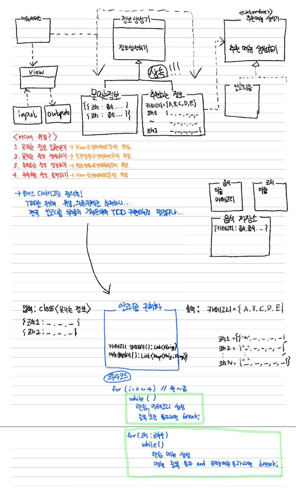

## 객체지향 설계 고민

1. 도메인을 구성하는 객체에는 어떤것들이 있나 고민  
     ㄴ 추천서비스, 추천서, 추천알고리즘, 추천메뉴, 카테고리들, 카테고리, 코치
2. 객체들 간의 관계를 고민  
     ㄴ 추천서비스 -- 추천서  
     ㄴ 추천서 -- 추천메뉴  
     ㄴ 추천서 -- 추천알고리즘  
     ㄴ 추천알고리즘 -- 카테코리들 -- 카테고리  
     
3. 동적인 객체를 정적인 타입으로 추상화해서 도메인 모델링하기  
     ㄴ 추천서비스 -- 추천서비스 타입  
     ㄴ 추천서 -- 추천서타입  
     ㄴ 코치 -- 코치타입  
     ㄴ 추천메뉴 -- 추천메뉴타입  
     ㄴ 추천알고리즘 -- 추천알고리즘타입  
     ㄴ 카테고리들 -- 카테고리들타입  
     ㄴ 카테고리 -- 카테고리타입  

4. 협력을 설계
5. 객체들을 포괄하는 타입에 적절한 책임을 할당
6. 구현하기

## 🚀 구현할 기능목록
### controller(C)
- [ ] 천체 서비스 입력 받기
- [ ] 추천받은 추천서 생성
- [ ] 결과 출력하기

### domain(M)
Recommendation
- [x] 모든 추천메뉴 생성하기(이름1추천메뉴객체, 이름2추천메뉴객체)

Algorithm
- [ ] 한 사람당 추천메뉴객체 생성하기(여기에 알고리즘)

RecommendationMenu
- [x] 추천메뉴들을 가져오기 - getMenus()
- [x] 추천메뉴 한개 추가하기 - add()

### ui(V)
- 입력
  - [ ] 코치 입력받기
  - [ ] 못먹는 메뉴 입력받기
- 출력
  - [ ] 서비스 시작 문구 출력
  - [ ] 메뉴 추천 결과 출력
  - [ ] 서비스 종료 문구 출력

### Repository
- [x] 전체 메뉴들을 저장하는 로컬 저장소 레포지토리생성

## 🚀 요구사항 정리

월, 화, 수, 목, 금

- 월요일 -> 카테고리 추천 -> 코치가 먹을 메뉴 추천

- 코치 -> 2 <= 이름글자수 <= 4  
- 코치와 함께 식사인원 -> 2명 ~ 5명까지  
- 코치가 못먹는 메뉴 -> 0~2개 있음
  - 못먹는 메뉴가 없으면 빈값입력
  - 추천 못하는 경우는 없음

- 같은 카테고리는 최대 2회까지 고를 수 있다
- 각 코치에게 한 주에 중복되지 않는 메뉴를 추천해야 한다

- 메뉴 추첨 완료시 프로그램 종료  

- 잘못된 값 입력시 예외발생(메세지 출력) -> 다시 입력받음